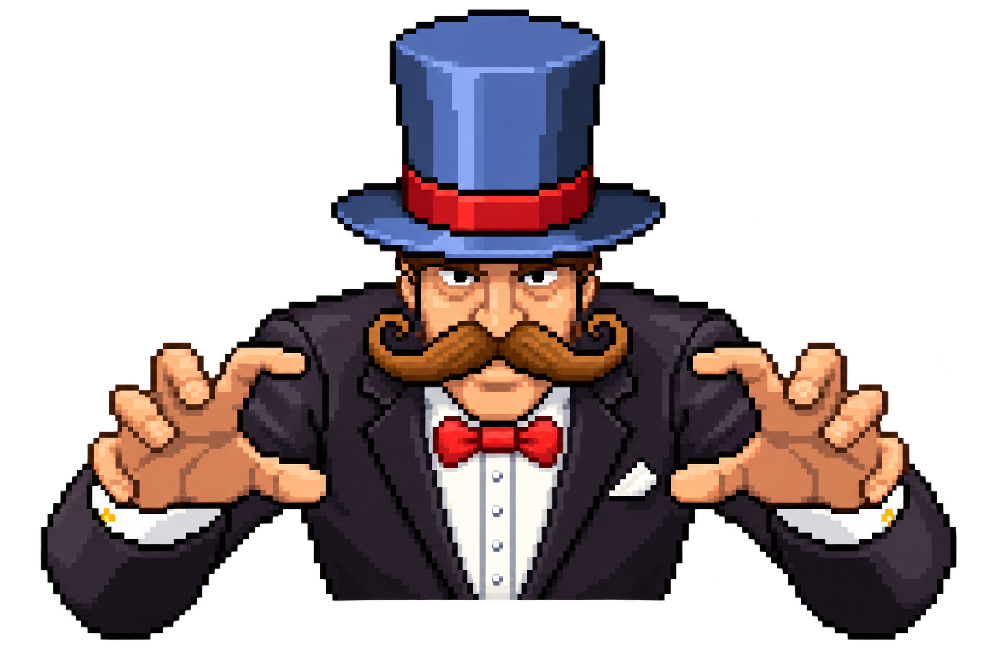
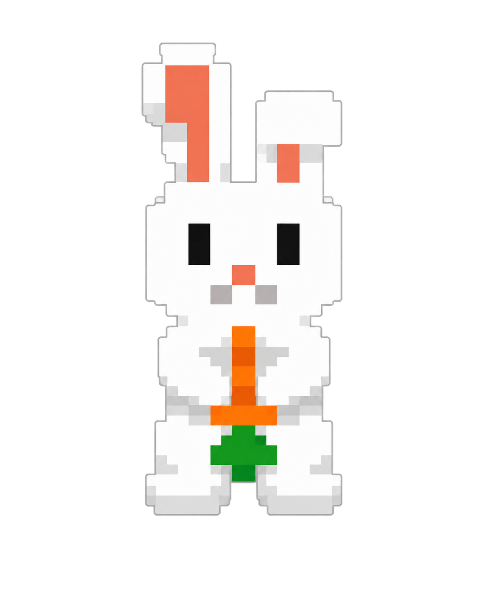
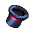
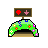
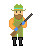

<div align="center">
  

  # 🎩 Rabbit Chaos 🐇

  **Um espetáculo de magia onde os coelhos não pretendem colaborar.**

  `Pixel Art` · `HTML` · `CSS` · `JavaScript` · `Beta Web`
</div>

---

## Sobre o jogo

**Rabbit Chaos** é um jogo de ação e estratégia em pixel art no qual você controla a mão mágica de um ilusionista. Sua missão é capturar os coelhos comuns espalhados pelo tabuleiro e colocá-los na cartola antes que o espetáculo saia completamente do controle.

O problema é que esses não são coelhos indefesos: eles se movimentam, procuram frutas mágicas, ficam mais poderosos, reproduzem-se por meio das tocas e podem atacar o próprio mago.

O resultado mistura a precisão de um jogo de tiro, o caos de um *space shooter* e a leitura rápida de um tabuleiro em perspectiva 2.5D.

<p align="center">
  
  &nbsp;&nbsp;&nbsp;
  
  &nbsp;&nbsp;&nbsp;
  
</p>

## Da caça ao grande espetáculo

Rabbit Chaos começou com uma proposta bem diferente: o jogador seria um **caçador enfrentando coelhos inteligentes**. A primeira versão seguia uma ideia próxima de *Duck Hunt* com elementos de *space shooter*:

- o caçador atirava nos coelhos;
- projéteis inimigos podiam ser destruídos no ar;
- tocas precisavam ser eliminadas para impedir a reprodução;
- frutas e hortaliças funcionavam como melhorias para os coelhos.

Essa base estabeleceu o ciclo de risco e reação, mas a identidade do projeto evoluiu. O caçador deu lugar a um **mágico tentando reunir coelhos para sua apresentação**, transformando o combate em um espetáculo mais carismático e original.

Os elementos do antigo protótipo — incluindo o caçador e seus projéteis — continuam preservados em [`old-sprites`](old-sprites/) como parte da história do desenvolvimento.

<table align="center">
  <tr>
    <td align="center"><strong>Primeiro conceito</strong></td>
    <td align="center"></td>
    <td align="center"><strong>Conceito atual</strong></td>
  </tr>
  <tr>
    <td align="center"></td>
    <td align="center">➜</td>
    <td align="center"></td>
  </tr>
  <tr>
    <td align="center">Caçar os coelhos</td>
    <td align="center"></td>
    <td align="center">Capturar para o espetáculo</td>
  </tr>
</table>

## Objetivo

Cada ato começa com coelhos, tocas e frutas distribuídos pelo tabuleiro.

Para concluir o nível, capture todos os coelhos comuns e elimine qualquer coelho que tenha sido fortalecido por magia. Se os ataques inimigos consumirem todo o fôlego do mago, as cortinas se fecham e a partida termina.

### Durante o espetáculo

- **Capture coelhos comuns:** segure-os com a mão mágica e arraste-os até a cartola.
- **Destrua as tocas:** elas podem trazer novos coelhos para o tabuleiro.
- **Elimine frutas mágicas:** um coelho que alcançar uma delas se torna uma ameaça.
- **Enfrente coelhos fortalecidos:** eles atacam o mago e não podem ser capturados normalmente.
- **Destrua projéteis:** use sua magia para impedir que os ataques atinjam o jogador.
- **Administre a recarga:** cada feitiço entra em cooldown após ser utilizado.

## Controles

| Ação | Controle |
|---|---|
| Mover a mão mágica | Movimento do mouse |
| Agarrar um coelho comum | Segurar o botão esquerdo |
| Colocar o coelho na cartola | Arrastar e soltar sobre a cartola |
| Lançar magia | Botão direito sobre o tabuleiro |
| Cancelar uma captura | `Esc` |

## Estado atual — Beta Web

A versão atual foi construída com **HTML, CSS e JavaScript puro**. Ela funciona como uma beta jogável e como campo de testes para as principais decisões do projeto.

Já fazem parte desta versão:

- tabuleiro em perspectiva 2.5D;
- progressão por atos;
- movimentação autônoma dos coelhos;
- reprodução por tocas;
- frutas que fortalecem coelhos;
- ataques e sistema de vidas;
- magia com área de efeito e recarga;
- captura por arrastar e soltar;
- cursor mágico com estados de *idle*, *drop* e *hold*;
- sprites refinados mantendo a identidade em pixel art.

> Esta beta não representa o limite do projeto. Ela é a fundação usada para validar a jogabilidade, o ritmo e a direção artística antes de uma produção maior.

## Como executar

O projeto não exige instalação de dependências ou processo de compilação.

```bash
git clone https://github.com/AloneJr/rabbit-chaos.git
cd rabbit-chaos
python -m http.server 8000
```

Depois, abra [http://localhost:8000](http://localhost:8000) no navegador.

Também é possível abrir o arquivo `index.html` diretamente, embora um servidor local seja recomendado para manter o comportamento consistente entre navegadores.

## Estrutura do projeto

```text
rabbit-chaos/
├── assets/         # Sprites e texturas utilizados pela versão atual
├── old-sprites/    # Arquivo visual dos conceitos e sprites anteriores
├── index.html      # Estrutura da interface e do palco
├── style.css       # Visual, perspectiva 2.5D e animações
└── script.js       # Regras, entidades, combate e progressão
```

## Próximos passos

O desenvolvimento futuro pretende expandir tanto a apresentação quanto a profundidade da gameplay:

- [ ] criar animações de caminhada para os coelhos;
- [ ] animar os braços do mago ao capturar coelhos e lançar feitiços;
- [ ] desenvolver novos tipos de coelhos, ameaças e poderes;
- [ ] adicionar mais cenários, atos e variações de tabuleiro;
- [ ] trabalhar efeitos sonoros, música e maior feedback visual;
- [ ] aprofundar progressão, dificuldade e balanceamento;
- [ ] reconstruir a experiência como uma versão definitiva em uma engine como **Unity**.

A meta é usar tudo o que for aprendido com esta beta web para criar uma versão mais completa, animada e expansível, sem perder o humor, o caos e a identidade em pixel art que deram origem ao jogo.

## Tecnologias

- **HTML5** para a estrutura do jogo;
- **CSS3** para o palco, HUD, perspectiva e efeitos;
- **JavaScript** para entidades, movimentação, combate e estados da partida;
- **Pixel art** para personagens, objetos e ambientação.

---

<div align="center">
  <strong>O espetáculo está apenas começando.</strong><br>
  Feito com magia, pixel art e uma quantidade questionável de coelhos.
</div>
